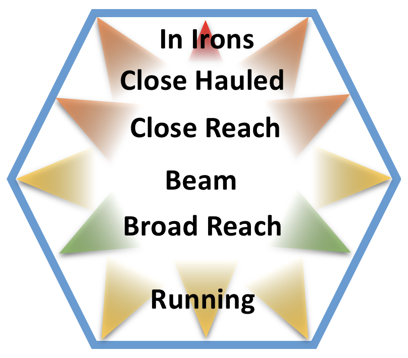
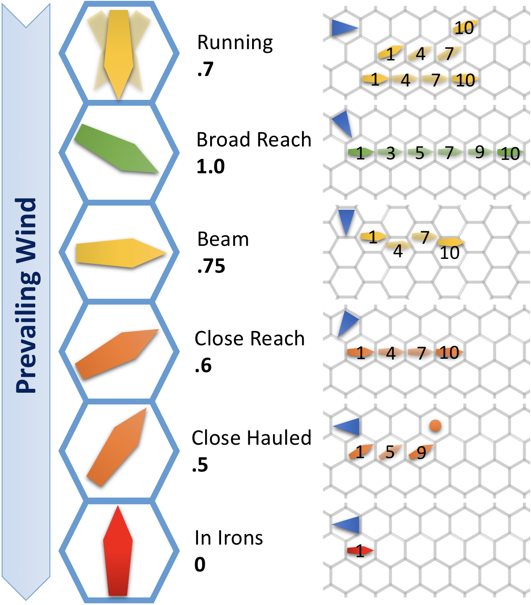

# Naval Combat

These rules were developed for the author's alternate beginning to *Tomb of Annihilation*. The party begins in Moonshae. Lady Erliza is the patron for their quest. The PCs take the *Brazen Pegasus* from the harbor at Westphal to Port Nyanzaru, choosing how close they want to sail to the Nelanthar Isles which are a known haven for pirates. When the pirates attacked, we setup the two ships on a hex grid and played the rounds by these rules. They look a bit fiddly, but everything plays smoothly if you keep track of the rounds on some version of the ship movement table. Any other overhead comes only once each 10 rounds.

## Naval Encounters

Oceans and seas are vast places. Random encounters are unlikely outside of hot spots closer to shore or known trade routes. Encounters should make sense and be part of the narrative. Being attacked by pirates while skirting the Nelanthar Isles, for example, would make a lot of sense. Bumping into another ship off the known trade routes should be reserved for when both parties have a narrative-driven reason to be in the same place. One such reason may be that PCs or NPCs have access to spells or magic items that allow them to track another vessel, one or more members of its crew, or some item aboard it.

### Seeing Other Ships

On a clear day, a ship that has posted a watch will spot other ships within four miles, seven miles if the watch is in a crow's nest. The same is true at night, assuming the other ship is running with any lighting. At the DM's discretion, this may be subject to a test for the crew's discipline. Any other factors, like natural or supernatural weather or ships using magic to hide, are up to the DM. If no watch is posted, use passive perception for the crew as the other vessel approaches, modifying for vessel size and relative closing speed.

### Giving Chase

Should two (or more) vessels want to approach once they have seen each other, they can do so. It is up to the DM to place the ships on the board, relative to each other and the wind, prior to entering naval combat.

### Surprise

If one vessel is able to get close to another without being detected (e.g. running dark with magical fog in the night), it is up to the DM to place the ships on the board, relative to each other and the wind, prior to entering naval combat.

### Placing Ships for Naval Combat


## Naval Combat Sequence

Naval combat follows a rough action sequence that wraps around the normal combat sequence. Each naval turn is 1 minute. The condensed rules below assume sailing vessels. In each naval turn, take the following steps.

### Helm Check

The captain or person at the helm of each vessel rolls Wis (Perception), with proficiency available only for sailors. Ships take turns acting and moving in reverse order of these rolls, so that ships with higher rolls can react to ships with lower rolls. Ships with no one at the helm automatically get a 0 for their helm checks. Roll off to resolve ties.

### Captain/Officer Actions

The captain and up to one officer may each roll Cha (Intimidation) or Cha (Persuasion) checks to attempt an action for the turn. The potential actions are listed below. The DC of each action is listed with the action. Unless noted in the action, attempting the action, whether it succeeds or fails, is the only thing the officer an do during the naval turn. "Helm only” actions may only be take by the captain or an officer if they are at the helm.

### Movement

Each ship declares a new heading within their ship's turn limit and a rigging step of 0, 1/4, 1/2, or full speed, which can normally only be changed by one step per turn. The resulting movement and relative locations of the ships are interpolated over the combat rounds in the naval turn/minute.

### Combat Rounds

Characters take part in 10 rounds of standard combat on and between ships, rolling initiative before the first round of each naval minute. Be aware that effects that knock them prone or push them could result in characters in the water. Ship-to-ship ranged weapon attacks are always at disadvantage, unless specifically noted in the rules. See below for more details on character combat in naval encounters.

## Naval Hex Movement

Naval engagements can be played using paper, pencils, rulers, and protractors. However, it’s easier to play on a hex grid. On a hex grid, a ship can have the following potential facings in relation to the wind: Running, Broad Reach, Beam, Close Reach, Close Hauled, and In Irons.

### Ship facings relative to wind



Moving from one facing to an adjacent facing counts as a turning step. Note that the three facings of Running are considered a single facing for purposes of turning. It is a single step to either Broad Reach facing from any Running facing and vice versa.

Movement is a combination of a ship’s top speed, its rigging, and its facing with regard to the true wind. When determining the number of hexes to move, the equation is simple. The hex count is always rounded down. Ships and wind are tricky.

```speed’ * rigging * facing / 100’```

When playing on a hex grid, the wind will always be aligned with a hex facing. Movement is taken in steps prior to each combat round, as shown in the chart. A ship with the speed indicated in the left column advances one hex in each of the rounds indicated. Ship movement happens before the start of the combat round for the characters.

### Rounds when ships move for each speed in hexes

| Speed | Rnd 1 | Rnd 2 | Rnd 3 | Rnd 4 | Rnd 5 | Rnd 6 | Rnd 7 | Rnd 8 | Rnd 9 | Rnd 10 |
| :--- | :--: | :--: | :--: | :--: | :--: | :--: | :--: | :--: | :--: | :--: |
| 1 hex |  |  |  |  |  |  |  |  ⛵️ |  |  |
| 2 hexes |  |  |  |  | ⛵️ |  |  |  | ⛵️ |  |
| 3 hexes |  |  |  | ⛵️ |  |  | ⛵️ |  |  | ⛵️ |
| 4 hexes |  |  | ⛵️ |  |  | ⛵️ |  | ⛵️ |  | ⛵️ |
| 5 hexes |  |  | ⛵️ |  | ⛵️ |  | ⛵️ |  | ⛵️ | ⛵️ |
| 6 hexes |  |  | ⛵️ | ⛵️ |  | ⛵️ | ⛵️ |  | ⛵️ | ⛵️ |
| 7 hexes | | ⛵️ | ⛵️ | ⛵️ | | | ⛵️ | ⛵️ | ⛵️ | ⛵️ |
| 8 hexes | | ⛵️ | ⛵️ | ⛵️ | ⛵️ | | ⛵️ | ⛵️ | ⛵️ | ⛵️ |
| 9 hexes | ⛵️ | ⛵️ | ⛵️ | ⛵️ | ⛵️ | | ⛵️ | ⛵️ | ⛵️ | ⛵️ |
| 10 hexes | ⛵️ | ⛵️ | ⛵️ | ⛵️ | ⛵️ | ⛵️ | ⛵️ | ⛵️ | ⛵️ | ⛵️ |

The diagram below shows movement examples of a fully rigged ship with a top speed of 500’/minute. Unless the party gets into a protracted encounter or there is some other source of weather variation, assume the wind is steady.

### Movement examples



A ship that is Close Hauled or Running to one side always moves forward two hexes and then advances toward its vertex facing, as shown above. Use a marker to indicate the next move the ship will take that is toward the vertex it is facing. Move the marker each time the ship reaches its hex to show the new vector.

## Naval Combat Actions

These are the actions available to the captain and officers aboard the ship. As noted above, each character may only take one action, it is their action for the entire naval turn, and only two characters may take these actions per naval turn on each ship. The characters must be the captain or officers. Alternatively, a character with sailing can make an intimidation or persuasion check to attempt to give an order to the crew. The DC is based on the discipline of the crew and how comfortable they are with the character. The character must then roll for the order as a separate check.

### Board (DC 20).

If the ship is within 50’ of each other or in the same hex during one round of combat. The ships remain in contact for the next 1d6 rounds and they move together as the average of their vectors. Creatures on the ship may make a DC 15 Str (Athletics)or Dex (Acrobatics) check to leap onto the other ship as a Move. Failure means falling into the water. The captain/officer taking the action, may take part in combat rounds as normal. Failure means the ships move as normal and ship-to-ship walking, running, or leaping moves are not allowed.

### Broad Reach (DC 20, Helm Only).

The ship must be fully rigged at the start of the turn and at Broad Reach to the wind. Add 10% to the ship’s speed for the turn. Failure means the ship moves as normal.

### Fast Rig (DC 15).

Change the ship’s rigging by up to two steps, specified before making the check, instead of one. Failure means the rigging changes by one step toward the desired rigging.

### “Hard to…” (DC 15, Helm Only).

Change the ship’s heading by up to an additional step above the allowed turn stat for the ship. The desired heading must be declared before making the check. Failure means the ship makes its normal maximum turn in that direction.

### “Steady as she goes.” (DC 10, Helm Only).

Boarding attempts from this ship are at DC 10 and short-range ranged weapon attacks from this ship do not have disadvantage. The ship may neither change its heading nor its rigging. Failure means boarding attempts and ranged weapons attacks follow the standard rules.

### “Repel Boarders!” (DC 15).

The defenders line up on one side of the vessel. They have advantage on attacks against each boarder coming over that side of the vessel, until that boarder starts a turn on the ship. Each defender gains the ability to react to a boarder arriving within 5’ of them with an opportunity attack. Any boarder wounded by one of these opportunity attacks must pass a DC 10 + damage Str save or fall into the water. The captain/officer may take part in combat rounds as normal. Failure means creatures on the ship do not gain the desired advantages agaist boarders.

### Rescue (DC 15, 20 in darkness or fog).

This may only be attempted in the turn immediately after a creature fell in the water from this ship or when the ship is motionless next to the creature in the water. The creature in the water must pass any required swimming tests, etc. as long as they are in the water and must pass a Str (Athletics) or Dex (Acrobatics) check to complete their rescue. Failure means the ship cannot rescue the target this naval turn. The crew is busy for the turn either way.

## Combat

### Distances

Each hex is considered 100’ for purposes of ranged and spell attacks. A boat in an adjacent hex is 100' away. Boats in the same hex are 50' apart, unless one of them has succeeded in a boarding action.

### Ranged combat

As described above, unless a ship succeeds in a "Steady as she goes." action, all ranged attacks from the ship to targets that are not on the ship suffer disadvantage.

### Targeting ships

While the ships of Faerûn do not have rows of cannons, magic provides an effective equivalent. In particular, fire can be nasty on a ship. Remember that each vessel has a damage threshold for each attack that must be met or exceeded before the ship takes the damage. Almost all ships are **immune** to **necrotic**, **poison**, and **psychic** damage, **resistant** to **piercing** damage, and **vulnerable** to **fire** damage.

If a ship takes fire or lightning damage, from a single attack, that is double its damage threshold or more, it catches fire. If a ship catches fire, the officers get one attempt at a fire fighting naval action at the beginning of the next naval turn. If they attempt the action, it is the only action they can try that turn. If it fails, the crew begin to jump overboard and the ship will be lost. If a ship catches fire from more than one attack, it cannot be saved.

These rules do not go into great detail on the effects of damage to a ship. At 0 hp, a ship slows to 0' or zero hexes per naval turn and begins to sink. When a ship falls below half its starting hp, the Broad Reach, Fast Rig, and "Hard to..." actions are no longer available to its crew.

### "Fight that fire!" (DC 20)

The entire crew organizes for a desperate struggle to put out the fire. That is all any of the crew member can do this turn, unless they are already engaged in melee combat. The minimum crew complement for the vessel must be available for the action. If the action is successful, the ship takes damage equal to the number of hp it lost to the attack that caused the fire and then the fire is put out and the battle resumes as normal. If not, the crew begins abandoning ship. No more orders may be given on the ship.

## Example ships

| Ship | Speed | Per Naval Turn | Normal Turn Steps | Min Crew | AC | HP | DT |
| :--- | ---: | ---: | :---: | :---: | :---: | ---: | :---: |
| Pirate Cog | 3 mph | 264’ | 1 | 5 | 15 | 300 | 20 |
| *Fast* Sloop | 10 mph | 880’ | 1 | 3 | 12 | 150 | 15 |
